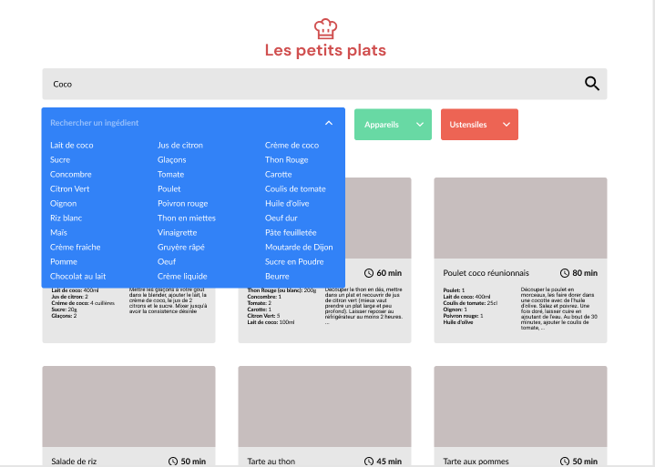

  

# Les petits plats

Après avoir édité des livres de cuisine pendant plusieurs années, l’entreprise a décidé de se lancer dans un nouveau projet : réaliser son propre site de recettes de cuisine à l’instar de Marmiton ou 750g.  

